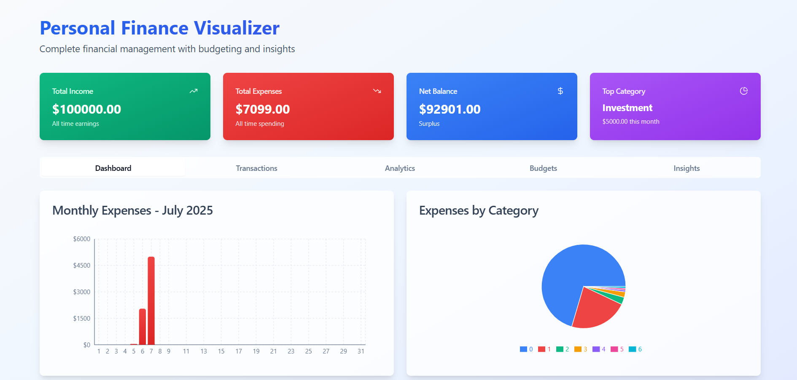
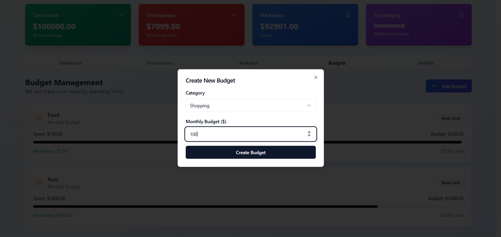
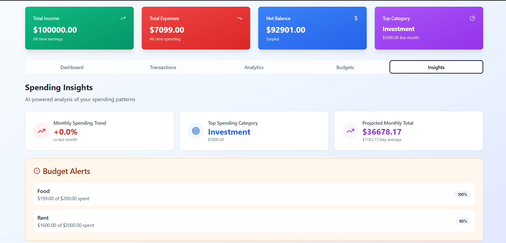

# 📊 Finance Tracker

A full-stack personal finance tracker for managing transactions, budgets, and getting spending insights.

## 🧱 Tech Stack

| Layer      | Tech                                           |
|------------|------------------------------------------------|
| Frontend   | **React**, **TypeScript**, **shadcn/ui**, **Recharts** |
| Backend    | **Node.js**, **Express.js**, **MongoDB**, **Mongoose** |
| Middleware | express-validator, dotenv, cors, morgan        |

---

## 🚀 Features

### ✅ Frontend
- 💻 Built with **React**, **TypeScript**, and **shadcn/ui**
- 📅 Add/edit/delete transactions with category selection
- 📊 Monthly expense bar chart using Recharts
- 📚 Budget management per category/month
- 📈 Budget vs Actual comparison
- 📂 Category breakdown & spending insights
- ⚠️ Alerts and modals (Dialog, Confirm)
- 💡 Fully responsive with form validation

### ✅ Backend
- 🔧 RESTful APIs with Express.js
- 🧠 MongoDB aggregation pipelines for analytics
- 📎 CRUD operations for Transactions & Budgets
- 📊 Analytics routes: spending insights, trends, breakdown
- 🧪 Validation with `express-validator`
- 🌐 CORS support
- 🪵 Logging with Morgan
- 🗂️ Central error handler
- 🧼 Input sanitization and validation
- ⚙️ Environment variables managed with `dotenv`

---

## 📁 Folder Structure

### 📦 Backend

```
backend/
├── controllers/
│ ├── transactionController.js
│ ├── budgetController.js
│ └── analyticsController.js
├── models/
│ ├── Transaction.js
│ └── Budget.js
├── routes/
│ ├── transactions.js
│ ├── budgets.js
│ └── analytics.js
├── middleware/
│ ├── errorHandler.js
│ ├── validation.js
│ └── cors.js
├── utils/
│ ├── database.js
│ └── helpers.js
├── app.js
└── server.js
```


### 🧾 Frontend

```
frontend/
├── src/
│ ├── components/
│ ├── types/
│ ├── hooks/
│ ├── pages/
│ ├── lib/
│ └── App.tsx
└── package.json
```

---

## 🖼️ Screenshots

### 💰 Transaction List


### 📚 Budget Management


### 📈 Spending Insights


---


##  Setup Instructions

```bash
git clone https://github.com/aman0603/fin-tech
```

**Create a .env file in the backend directory**

```bash
PORT=5000
MONGODB_URI=<Your MongoDB connection string>
NODE_ENV=development
```

**Replace all placeholder values with your actual credentials.**

**Run the backend server**

### 📦 Install Backend Dependencies

```bash
cd backend
npm install
node server.js
```
### 📦 Install Frontend Dependencies

```bash
cd frontend
npm install
npm run dev
```


